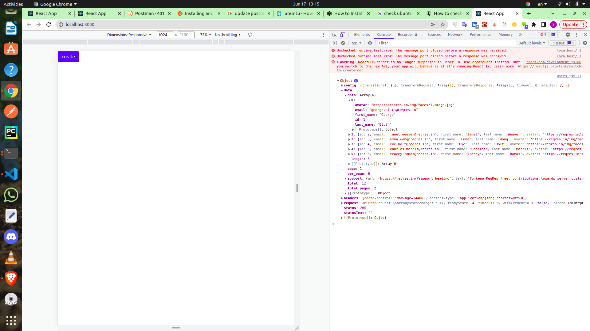

## Ubuntu Show Version Number using /etc/os-release file
```jsx
cat /etc/os-release
```


## install
* create-react-app users
* cd users
* npm i bootstrap axios


### get users

```jsx
 async componentDidMount(){
    const response = await axios.get('https://reqres.in/api/users');
    console.log(response);
    console.log(response.data);
    console.log(response.data.data);
    
  }

```



```jsx
 async componentDidMount(){
    const response = await axios.get('https://reqres.in/api/users');
    console.log(response);
    
  }
this.setState({users: response.data.data});
```


## loading

```jsx
[react-loading-skeleton](https://www.npmjs.com/package/react-loading-skeleton)

npm i react-loading-skeleton

```

```jsx
// javascript
Array(6).fill({})
```

## users data
```jsx
 <button onClick={()=>{this.handleUpdate(user)}}
          className="btn btn-info btn-sm"
  >
      Update
  </button>

handleUpdate = (user) => {
    console.log(user)
  };

// inspect/click on update button and get users data
```


## create User
```jsx
 <button onClick={this.handleCreate} className="btn btn-lg btn-primary">
          create
 </button>
// handleCreate
 handleCreate = async () => {
    const newUser = {
      first_name: 'aa',
      last_name: 'abc',
      email: 'abc@gmail.com',
      avatar: '(../../screenshots/avatar.png)'
    };
    const response = await axios.post('https://reqres.in/api/users', newUser);
    // console.log(response)
    this.setState({ users: [...this.state.users, newUser] });
    
  };
```

## update user
```jsx
 <button  onClick={()=>{this.handleUpdate(user)}}
          className="btn btn-info btn-sm"
  >
    Update
  </button>
 // update

  // handleUpdate = (user) => {
  //   console.log(user)
  // };

  handleUpdate = async (user) => {
    user.first_name = 'updated';
    const response = await axios.put(`https://reqres.in/api/users/${user.id}`, user);
    console.log(response)
    const updatedUsers = [...this.state.users];
    const index = updatedUsers.indexOf(user);
    updatedUsers[index] = {...user};
    this.setState({users: updatedUsers});
  };  


```