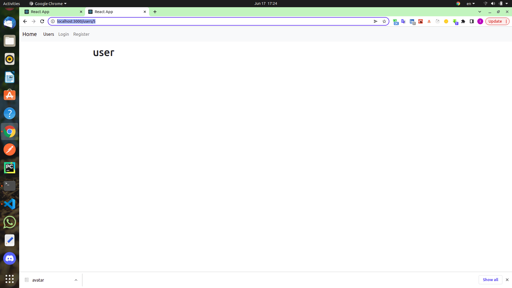
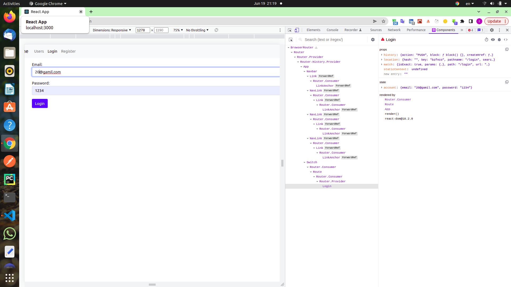

## Ubuntu Show Version Number using /etc/os-release file
```jsx
cat /etc/os-release
```


## install
* create-react-app users
* cd users
* npm i bootstrap axios


### get users

```jsx
 async componentDidMount(){
    const response = await axios.get('https://reqres.in/api/users');
    console.log(response);
    console.log(response.data);
    console.log(response.data.data);
    
  }

```


```jsx
 async componentDidMount(){
    const response = await axios.get('https://reqres.in/api/users');
    console.log(response);
    
  }
this.setState({users: response.data.data});
```


## loading

```jsx
[react-loading-skeleton](https://www.npmjs.com/package/react-loading-skeleton)

npm i react-loading-skeleton

```

```jsx
// javascript
Array(6).fill({})
```

## users data
```jsx
 <button onClick={()=>{this.handleUpdate(user)}}
          className="btn btn-info btn-sm"
  >
      Update
  </button>

handleUpdate = (user) => {
    console.log(user)
  };

// inspect/click on update button and get users data
```


## create User
```jsx
 <button onClick={this.handleCreate} className="btn btn-lg btn-primary">
          create
 </button>
// handleCreate
 handleCreate = async () => {
    const newUser = {
      first_name: 'aa',
      last_name: 'abc',
      email: 'abc@gmail.com',
      avatar: '(../../screenshots/avatar.png)'
    };
    const response = await axios.post('https://reqres.in/api/users', newUser);
    // console.log(response)
    this.setState({ users: [...this.state.users, newUser] });
    
  };
```

## update user
```jsx
 <button  onClick={()=>{this.handleUpdate(user)}}
          className="btn btn-info btn-sm"
  >
    Update
  </button>
 // update

  // handleUpdate = (user) => {
  //   console.log(user)
  // };

  handleUpdate = async (user) => {
    user.first_name = 'updated';
    const response = await axios.put(`https://reqres.in/api/users/${user.id}`, user);
    console.log(response)
    const updatedUsers = [...this.state.users];
    const index = updatedUsers.indexOf(user);
    updatedUsers[index] = {...user};
    this.setState({users: updatedUsers});
  };  


```

## delete user
```jsx
 <button  onClick={() => { this.handleDelete(user) }}
          className="btn btn-danger btn-sm"
  >
    Delete
  </button>
// delete
  // delete
  // handleDelete = (user) => {};

  handleDelete = async(user) => {
    const response = await axios.delete(`https://reqres.in/api/users/${user.id}`);
    const newUsers = this.state.users.filter(u => u.id !== user.id);
    this.setState({users: newUsers});
  };
```

## router
```jsx

npm i recat-router-dom
```
## point 

```jsx

npm install react-router-dom@5.3.0
```

```jsx
create
src/components/navbar.jsx
src/components/home.jsx
src/components/login.jsx
src/components/register.jsx
```
* 1.root(index.js),BrowserRouter
```jsx
// BrowserRouter
import { BrowserRouter } from "react-router-dom";
// src/index.js
import ReactDOM from 'react-dom';
import 'bootstrap/dist/css/bootstrap.min.css';
import App from './app';
import { BrowserRouter } from "react-router-dom";


// ReactDOM.render(<App/>, document.getElementById('root'));
ReactDOM.render(
  <BrowserRouter>
    <App />
  </BrowserRouter>,
  document.getElementById("root")
);
```
* 2.
```jsx
//Route 
import {Route} from 'react-router-dom';

// src/app.js
import React, { Component } from 'react';
import Users from './components/users';
import Navbar from './components/navbar';
import Login from './components/login';
import Register from './components/register';
import Home from './components/home';
import {Route} from 'react-router-dom';

class App extends React.Component {
  render() { 
    return <>
      <Navbar />
      <div className='container mt-3'>
        <Route path='/users' component={Users} />
        <Route path='/login' component={Login} />
        <Route path='/register' component={Register} />
        <Route path='/' component={Home} />
      </div>
    </>
  }
}
 
export default App;


```

## The root component is repeated everywhere
* 1.exact
```jsx
 <Route path='/' exact component={Home} />
```

* 2.switch
```jsx
// src/app.js
import React, { Component } from "react";
import Users from "./components/users";
import Navbar from "./components/navbar";
import Login from "./components/login";
import Register from "./components/register";
import Home from "./components/home";
import { Route, Switch } from "react-router-dom";

class App extends React.Component {
  render() {
    return (
      <>
        <Navbar />
        <div className="container mt-3">
          <Switch>
            <Route path="/users" component={Users} />
            <Route path="/login" component={Login} />
            <Route path="/register" component={Register} />
            // The most common component is at the end
            <Route path="/" component={Home} />
          </Switch>
        </div>
      </>
    );
  }
}

export default App;
```

## Link
```jsx
src/components/navbar.jsx
import {Link, NavLink} from 'react-router-dom';

tag a => link
link => NavLink
href => to

```

## props to route
```jsx
src/app.js
 <Route path="/users" render={(props)=>{<Users {...props}/>}} />

```
## Transfer information through URL
## Receive and transfer information
###  Parameter
```jsx
// src/app.js
import User from "./components/user";
<Route path="/users/:id" component={User} />

```

```jsx
// src/components/user.jsx
const User = (props) => {

  return (
    <>
     <h1>user</h1>
    </>
  );
};

export default User;

```

http://localhost:3000/users/5



## console.log(props.match.params)
```jsx
const User = (props) => {
console.log(props.match.params)
  return (
    <>
     <h1>user</h1>
    </>
  );
};

export default User;
// inspect/console.log
Object
id: "5"
```
## get user
* 1.
```jsx
// src/components/users.jsx
import { Link } from "react-router-dom";
 <Link to={`/users/${user.id}`}>
      <h4>
          {user.first_name} {user.last_name}
      </h4>
  </Link>
```
* 2
```jsx
// src/components/user.jsx
import { useState, useEffect } from "react";
// state
const [user, setUser] = useState({});
// useEffect
useEffect(async () => {
    const response = await axios.get(
      `https://reqres.in/api/users/${props.match.params.id}`
    );
    // console.log(response)
    setUser(response.data.data);
  },[]);
// user


<h4>
  {user.first_name} {user.last_name}
</h4>
<h5>{user.email}</h5>

```

###  query

```jsx
npm i query-string
```

```jsx
import queryString from 'query-string';
console.log(queryString.parse(props.location.search));
// 
http://localhost:3000/users/2?order=oldest&s=phone
// inspect/console
out=>
// Object
// order: "oldest"
// s: "phone"
```

### Redirect


```jsx
// src/components/notFound.jsx
const NotFound = () => {
  return ( <h1>Not found</h1> );
}
 
export default NotFound;
// src/app.js
import { Route, Switch, Redirect } from "react-router-dom";
import NotFound from "./components/notFound";
<Route path="/not-found" component={NotFound} />
<Redirect to="/not-found" />

// or
 <Redirect from="/customers" to="users" />

```
## click on button and redirect (push,replace)
```jsx
// src/componenst/user.jsx
<button onClick={()=>{props.history.replace('/users')}} className="btn btn-info mt-3">Users</button>

```


### control form
* 1.ref

#### class(createRef)

```jsx
// src/componets/login.jsx
import React, { Component, createRef } from 'react';
import axios from 'axios';

class Login extends Component {
// ref
  email = createRef();
  password = createRef();

  handleSubmit = async (e)=>{
    e.preventDefault();
    console.log('email: ', this.email.current.value);
    console.log('password: ', this.password.current.value);
    const account = {email:  this.email.current.value, password:  this.password.current.value};
    if(account.email && account.password){
      const response = await axios.post('https://reqres.in/api/login', account);
      console.log(response);
      // out =>
      // email: george.bluth@reqres.in
      // password:  1234
      // status : 200
    }
  }
  render() { 
    return (
      <form onSubmit={this.handleSubmit}>
        <div className="mb-3">
          <label htmlFor="email">Email:</label>
          <input ref={this.email} id="email" className='form-control' type="text"/>
        </div>
        <div className="mb-3">
          <label htmlFor="password">Password:</label>
          <input ref={this.password} id="password" className='form-control' type="text"/>
        </div>
        <button className="btn btn-primary">Login</button>
      </form>)
  }
}
 
export default Login;


```
#### func(useRef)
```jsx
// src/componets/user.jsx
import { useState, useEffect, useRef } from "react";
import axios from "axios";
import queryString from 'query-string';

const User = (props) => {
  const [user, setUser] = useState({});
  const firstName = useRef(null);
  console.log(queryString.parse(props.location.search));

  useEffect(async () => {
    const response = await axios.get(
      `https://reqres.in/api/users/${props.match.params.id}`
    );
    setUser(response.data.data);
    console.log(firstName.current);
  },[]);

  return (
    <>
      
      <h4 ref={firstName}>
        {user.first_name} {user.last_name}
      </h4>
      <h5>{user.email}</h5>
      <button onClick={()=>{props.history.replace('/users')}} className="btn btn-info mt-3">Users</button>
    </>
  );
};

export default User;
```
* 2.state

```jsx
// src/componets/login.jsx
import React, { Component } from 'react';
// import axios from 'axios';

class Login extends Component {
  state ={
    account: {
      email: '',
      password: ''
    }
  }
  handleSubmit = async (e)=>{
    e.preventDefault();
  }

  handleChange = async ({currentTarget: input})=>{
    const account = {...this.state.account};
    account[input.name] = input.value;
    this.setState({account});

  }

  render() { 
    const {email,password} = this.state.account;
    return (
    <form onSubmit={this.handleSubmit}>
      <div className="mb-3">
        <label htmlFor="email">Email:</label>
        <input onChange={this.handleChange} value={email}  id="email" name='email' className='form-control' type="text"/>
      </div>
      <div className="mb-3">
        <label htmlFor="password">Password:</label>
        <input onChange={this.handleChange} value={password}  id="password" name='password' className='form-control' type="text"/>
      </div>
      <button className="btn btn-primary">Login</button>
    </form>)
  }
}
 
export default Login;
```

